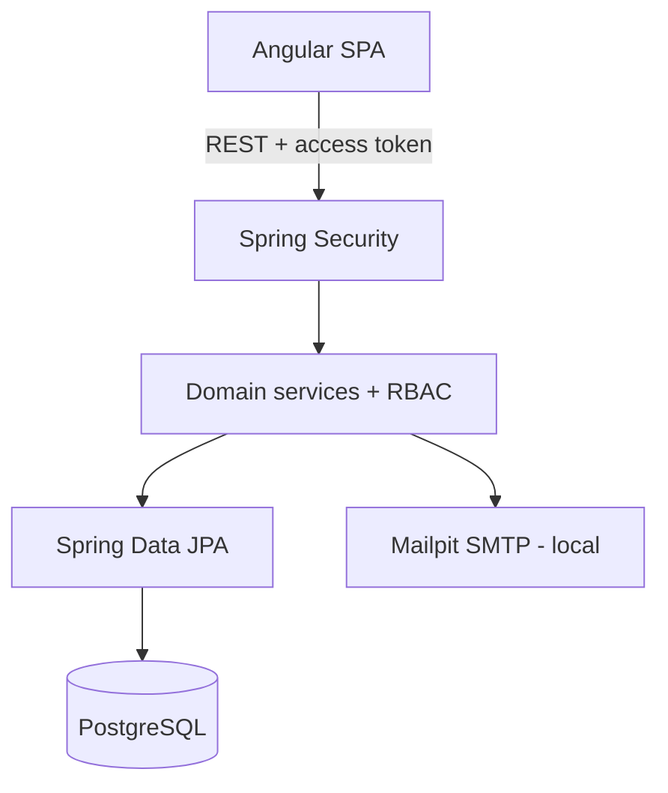

# Companages — Product Evolution Plan

## Current state

Companages is currently a working full-stack organization CRUD:

- Spring Boot 3 / Java 17 backend with controllers, services, repositories and DTO records.
- PostgreSQL schema managed by Flyway (`V1__create_schema.sql`).
- BCrypt passwords and stateless JWT access tokens.
- Owner-based isolation: an organization belongs to exactly one user.
- CRUD for organizations, members and positions, plus member-position assignments.
- Angular 22 standalone frontend with login, registration, dashboard and organization details.
- Docker Compose for PostgreSQL, backend and Nginx-hosted frontend.
- Backend integration tests and Angular unit tests.

## Problems and gaps

1. Ownership is not true multi-tenancy. A user cannot participate in multiple organizations with different roles.
2. `Member` is a contact record, not an association between `User` and `Organization`.
3. Access control only checks ownership; there is no reusable RBAC mechanism.
4. JWT has no refresh/revocation flow, password recovery or password change.
5. Organization details are minimal and deletion is destructive.
6. Teams, reporting hierarchy, invitations, activity logs and notifications do not exist.
7. List endpoints are unpaged and cannot search/filter/sort server-side.
8. The Angular organization-detail component is too large and there is no selected-organization context.
9. Tests cover the current core but not the new tenancy, RBAC or hierarchy rules.
10. Architecture documentation and demo data are missing.

## Existing functionality to preserve

- Registration/login behavior and BCrypt storage.
- Bearer JWT filter and consistent security errors.
- Flyway as the schema authority and `ddl-auto=validate` in runtime environments.
- Organization/member/position data already created by users.
- Angular visual language, responsive shell, toasts and loading/error/empty states.
- `/api/organizations/{organizationId}/...` resource scoping.
- Docker multi-stage builds, reverse proxy and health checks.

## Proposed architecture

The application remains a modular monolith. Packages will evolve incrementally; shared infrastructure stays in `config`, `security`, `exception` and common DTOs, while new domains receive focused entity/repository/service/controller classes. No microservices, message broker, distributed cache or WebSocket is introduced.

## Target data model

- `User`: account/profile and credentials.
- `Organization`: tenant metadata and lifecycle status.
- `OrganizationMember` (implemented by evolving the existing `members` table): membership, access role, job position, team, manager and employment profile.
- `Team`: department/team inside one organization.
- `Position`: professional job position, distinct from access role.
- `RefreshToken`: hashed/revocable session refresh token.
- `PasswordResetToken`: hashed, expiring, single-use reset token.
- `Invitation`: email invitation with role and lifecycle.
- `ActivityLog`: append-only audit event.
- `Notification`: user-facing persisted notification.
- Existing `Assignment`: retained during compatibility migration and then treated as legacy position history; the active position lives on membership.

## Migration strategy

1. Keep V1 immutable.
2. Add V2 to expand users/organizations/members/positions and create memberships, teams, sessions, invitations, activities and notifications.
3. Backfill an `OWNER` membership for every existing organization owner.
4. Preserve existing member and assignment rows; new columns are nullable where legacy data requires it.
5. Add indexes and constraints for tenant-scoped queries.
6. Use application-level validation plus database constraints for hierarchy and cross-tenant integrity.
7. Add optional demo seed through a Spring profile/environment flag, never production migrations.

## Planned API

### Authentication and profile

- `POST /api/auth/register`, `/login`, `/refresh`, `/logout`
- `POST /api/auth/forgot-password`, `/reset-password`, `/change-password`
- `GET /api/auth/me`, `PUT /api/users/me`

### Organizations and tenant context

- CRUD-like create/read/update/list with `archive` and `restore` instead of default destructive deletion.
- Tenant-scoped dashboard and settings.

### Members, teams and positions

- Paged/searchable/filterable collections under `/api/organizations/{organizationId}`.
- Member update includes team, position, manager, access role and status.
- Team and position archive/restore operations.

### Hierarchy

- `GET /api/organizations/{organizationId}/organization-chart`
- Manager updates reject self-management, cross-tenant managers and cycles.

### Invitations

- Send/list/resend/cancel under the organization.
- Public validate and authenticated accept endpoints.

### Activity and notifications

- Paged organization activity log with filters.
- Current-user notifications, unread count and read operations.

## Angular pages

- Authentication: login, register, forgot/reset password.
- Organization selector and organization settings.
- Dashboard with real tenant metrics.
- Members with search, filters and pagination.
- Teams and positions management.
- Interactive collapsible organization chart and member detail panel.
- Invitations, activity, notifications and user settings.

## Authorization model

| Capability | OWNER | ADMIN | MANAGER | MEMBER |
| --- | --- | --- | --- | --- |
| View tenant/chart | Yes | Yes | Yes | Yes |
| Manage teams/positions/members | Yes | Yes | Limited team | No |
| Invite users | Yes | Yes | No | No |
| Manage administrators/settings | Yes | Limited | No | No |
| Archive organization | Yes | No | No | No |
| Edit own profile | Yes | Yes | Yes | Yes |

Every tenant endpoint resolves the authenticated user's active membership before loading or changing data. UI visibility is convenience only; backend authorization is authoritative.

## Risks and mitigations

- **Existing database compatibility:** migrations are additive and V1 remains unchanged.
- **Hierarchy cycles:** walk the manager chain transactionally before persisting.
- **Token theft:** store only hashes of refresh/reset tokens and support revocation/expiry.
- **Role escalation:** centralize minimum-role checks; never accept owner role through ordinary member updates.
- **Large lists:** Spring Data pagination and database-side filters.
- **Email in local development:** Mailpit; external SMTP remains environment-configurable.
- **Frontend scope:** reusable list/form/state patterns and organization context avoid duplicating state.

## Implementation phases

1. **Audit and plan** — complete.
2. **Database/domain foundation** — V2 schema, enums and tenant entities.
3. **Authentication** — refresh, logout, reset and password change.
4. **Organizations/multi-tenancy/RBAC** — memberships, archive/restore, reusable authorization.
5. **Members** — paged queries, employment profile and status.
6. **Teams and positions** — tenant CRUD and archive lifecycle.
7. **Organization chart** — hierarchy query, UI tree and cycle validation.
8. **Invitations/email** — token lifecycle and Mailpit.
9. **Dashboard/activity** — metrics, audit writes and paged activity feed.
10. **Notifications/settings** — persisted inbox and profile/organization settings.
11. **Frontend refinement** — feature routes, selector, search/filter/pagination and responsive states.
12. **Tests** — auth, RBAC, tenancy, invitations and hierarchy scenarios.
13. **Docker/demo/docs** — Mailpit, optional demo profile, architecture docs and accurate README.

Each phase must compile and run its relevant tests before the next dependency layer is considered complete.
