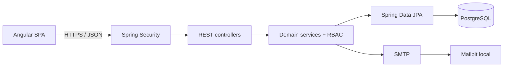

# Arquitetura

Companages é um monólito modular: a SPA Angular consome uma API Spring Boot, que concentra autenticação, autorização e regras do domínio antes de acessar o PostgreSQL. O Mailpit captura emails no desenvolvimento local.

## Multi-tenancy

`Organization` é o tenant. Toda operação de negócio recebe o identificador da organização e resolve primeiro a membership autenticada. Uma consulta sem membership retorna `404`, evitando revelar a existência de dados de outro tenant. As alterações exigem `OWNER`, `ADMIN` ou `MANAGER`, conforme a capacidade.

## Sessão

O access token JWT é curto e stateless. O refresh token é opaco, armazenado somente como hash e rotacionado a cada uso. Logout, troca e recuperação de senha revogam sessões aplicáveis. Tokens de convite e recuperação também são persistidos apenas como hash.

## Camadas

- `controller`: contrato HTTP e validação de entrada.
- `service`: transações, RBAC, hierarquia, auditoria e mapeamento.
- `repository`: consultas tenant-scoped e paginação.
- `entity`: persistência e ciclos de vida.
- `security`: JWT, filtro bearer e tokens opacos.
- `frontend/core`: sessão, interceptor, modelos e contexto da organização.
- `frontend/features`: páginas carregadas sob demanda.

## Decisões

- O banco é evoluído exclusivamente com Flyway; Hibernate valida o schema em runtime.
- Organizações, equipes, cargos e membros usam arquivamento/inativação em vez de exclusão destrutiva.
- Ciclos de subordinação e relacionamentos entre tenants são rejeitados antes da persistência.
- O log de atividade é append-only na aplicação.
