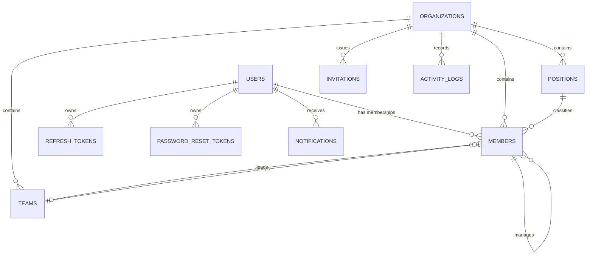

# Modelo de dados

`members` representa a participação de uma pessoa em uma organização. Quando a pessoa possui conta, `user_id` liga a membership ao login; contatos legados continuam válidos com `user_id` nulo. `access_role` controla permissão e `position_id` descreve o cargo profissional — conceitos propositalmente separados.

## Migrações

- `V1__create_schema.sql`: modelo original.
- `V2__saas_foundation.sql`: perfis, memberships, equipes, hierarquia, sessões, convites, auditoria e notificações.

A V2 preserva dados existentes e cria uma membership `OWNER` para o proprietário de cada organização. Nunca altere uma migração aplicada; crie a próxima versão.

## Integridade

- Uma conta possui no máximo uma membership por organização.
- Equipe, cargo, gestor e membro precisam pertencer ao mesmo tenant.
- A aplicação impede autogestão e ciclos na cadeia de gestores.
- Tokens sensíveis são hashes com expiração, revogação ou uso único.
